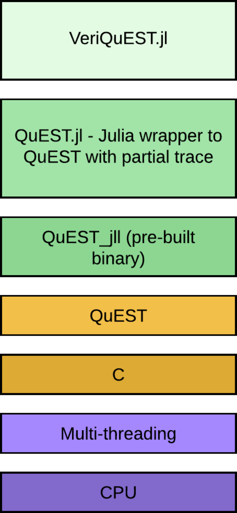
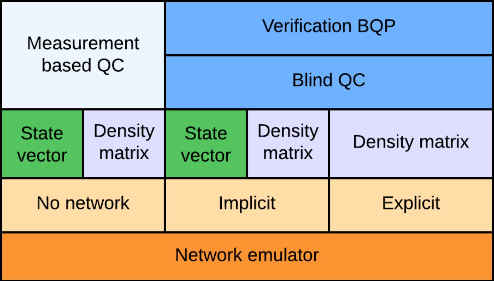

---
# To run locally as a JOSS paper
# docker run --rm --volume $PWD:/data --user $(id -u):$(id -g) --env JOURNAL=joss openjournals/inara
# To run locally just as compiled pdf
# pandoc paper.md --pdf-engine=pdflatex --from=markdown --output=draft_paper.pdf --bibliography=paper.bib --metadata link-citations=true 

# Your paper should include:
# A list of the authors of the software and their affiliations, using the correct format (see the example below).
# A summary describing the high-level functionality and purpose of the software for a diverse, non-specialist audience.
# A Statement of need section that clearly illustrates the research purpose of the software and places it in the context of related work.
# A list of key references, including to other software addressing related needs. Note that the references should include full names of venues, e.g., journals and conferences, not abbreviations only understood in the context of a specific discipline.
# Mention (if applicable) a representative set of past or ongoing research projects using the software and recent scholarly publications enabled by it.
# Acknowledgement of any financial support.
# As this short list shows, JOSS papers are only expected to contain a limited set of metadata (see example below), a Statement of need, Summary, Acknowledgements, and References sections. You can look at an example accepted paper. Given this format, a “full length” paper is not permitted, and software documentation such as API (Application Programming Interface) functionality should not be in the paper and instead should be outlined in the software documentation.
# Further: https://joss.readthedocs.io
title: 'VeriQuEST.jl: Emulating verification of quantum computations with QuEST'
tags:
  - Julia
  - quantum computing
  - measurement based quantum computing 
  - blind quantum computing
  - quantum verification
  - emulation
  - noise
  - decoherence
authors:
  - name: Jonathan Miller
    orcid: 0000-0002-5836-1736
    equal-contrib: true
    affiliation: 1
  - name: Dominik Leichtle
    orcid: 0000-0000-0000-0000
    equal-contrib: false
    affiliation: '2'
  - name: Elham Kashefi
    orcid: 0000-0000-0000-0000
    corresponding: false
    affiliation: '2'
  - name: Cica Gustiani
    orcid: 0000-0000-0000-0000
    equal-contrib: false
    affiliation: '2'
affiliations:
  - name: School of Informatics, University of Edinburgh, 10 Crichton Street, Edinburgh EH8 9AB, United Kingdom
    index: 1
  - name: 'Laboratoire d’Informatique de Paris 6, CNRS, Sorbonne Université, 4 Place Jussieu, Paris 75005, France'
    index: 2
date: 29 Jan 2024
bibliography: paper.bib

# Optional fields if submitting to a AAS journal too, see this blog post:
# https://blog.joss.theoj.org/2018/12/a-new-collaboration-with-aas-publishing
#aas-doi: 10.3847/xxxxx <- update this with the DOI from AAS once you know it.
#aas-journal: Astrophysical Journal <- The name of the AAS journal.

---
<!-- The paper should be between 250-1000 words. -->
<!-- Begin your paper with a summary of the high-level functionality of your software for a non-specialist reader. Avoid jargon in this section. -->


# Summary

Within the practical context of quantum computing, the _client-server_ framework is anticipated to become predominant in the future due to the high costs, intensive maintenance, and operational complexity of quantum computers. In this framework, a client with a very limited quantum power, so-called Alice, delegates her quantum computation to a powerful quantum server, so-called Bob, who then provides Alice her computation results. While this scenario appears practical, it raises significant security concern: how do we ensure Bob follows Alice's instructions and confirm the reliability of his quantum computer? 
These questions undeniably pose significant challenges and remain under active investigation; _verifiable quantum computations_ is a subfield of quantum computing that aims to address these concerns. 

This paper introduces `VeriQuEST.jl`, a Julia package equipped with functionalities to emulate verification protocols for quantum computation [@gheorghiu2019verification] within the framework of measurement-based quantum computations [@raussendorf2001one]. The package utilizes QuEST [@QuESTJones2019] as its backend, a versatile quantum computer emulator (including noise simulation) written in C, while supporting high-performance computations. VeriQuEST.jl is designed to aid researchers in testing their verification protocols or concepts on emulated quantum systems. This approach allows them to assess performance estimates without the need for actual hardware, which, at the time of writing this paper, is significantly limited.


<!-- We also require that authors explain the research applications of the software. -->
# Statement of need

Our package `VeriQuEST.jl` is aimed at assisting researchers in exploring and designing their verification protocols within the paradigm of _measurement-based quantum computation_ (MBQC). The conventional way to express quantum algorithms is through a series of unitary operations and measurements, so-called _gate-based_ computations [@nielsenchuang]. On the other hand, MBQC uses a _graph state_ as the resource and a series of adaptive single-qubit measurements to realise a quantum algorithm. While gate-based emulators -- such as `QuEST` -- are predomonant, MBQC emulators remain scarce. Our package, VeriQuEST.jl, offers an interface that enables users to express their verification protocols and quantum algorithms in the native MBQC language, supporting interactive protocols, such as verifications, that require a quantum internet, powered by a performant backend `QuEST` [@QuESTJones2019].  Moreover, to this date, there is no emulator that is specifically aimed at simulating verification protocols. 

# Core features and functionality

`VeriQuEST.jl` is equipped with fundamental functionalities to support the testing of various verification protocols of quantum computations based on MBQC. The package `VeriQuEST.jl` contains three fundamental elements to support emulation of verification protocols: MBQC computations, multi-round interactions between client and server, and Hilbert space partition to realize the explicit client-server separation. The package allows for (noiseless) state vector and (noisy) density matrix simulations. In the current release, we provide several well-known MBQCs and verification protocols ready for the users to use. If one wishes to become acquainted with the details, see the public GitHub repository for [`VeriQuEST`](https://github.com/fieldofnodes/VeriQuEST.jl).


## Software architecture

VeriQuEST.jl is a package written entirely in `Julia`, however to emulate the quantum computation, the `C` wrapper `QuEST.jl` which utilises the library `QuEST` is used. `QuEST.jl` calls the `C` through a precompiled verions (`v3.7`) of `QuEST`, with a number of features on the `Julia` level to prevent run-time crashes. There are some experimental features, but basic usage and specifically calls relevant to `VeriQuEST.jl` are sound. The user takes advantage of the `Julia` just-in-time compilation and can run scripts or functions per standard `Julia` usage. There are many functions not automatically exported to the user but available in the normal way (e.g., calling `VeriQuEST.<function/struct/type-call>`). `QuEST` can be compiled to run on multi-core, multi-threads, distributed and GPU clusters, however here `QuEST.jl` uses pre-compiled binaries suited for multi-threading only.






## Measurement-Based Quantum Computation (MBQC)

In the MBQC framework, a quantum algorithm can be represented as a set $\{(G, I, O), \vec{\phi}\}$, where $(G, I, O)$ denotes the quantum resource and $\vec{\phi}$ is a set of measurement angles. The triplet $(G, I, O)$ signifies an _open graph_, i.e., graphs characterised by the presence of _flow_ [@danos2006determinism]. Single-qubit adaptive measurements are performed sequentially on the vertices with measurement operator $\{|+_{\theta_j}\rangle\!\langle +_{\theta_j}|,|-_{\theta_j}\rangle\!\langle -_{\theta_j}|\}$, measured on vertex $j$, where $|\pm_{\theta}\rangle\coloneq (|0\rangle\pm e^{i\theta}|1\rangle)/\sqrt{2}$ and $\theta_j=\phi_j+\delta$ for a correction $\delta$ that is calculated by our tool. For an illustration, see \autoref{fig:graph}.

![The triplet $(G, I, O)$ representing graph state for the quantum resource, where $G=(V,E)$ is the graph, $I$ is a set of input nodes, and $O$ is a set of output nodes. Each node represents qubit with state $(|0\rangle+|1\rangle)/\sqrt 2$ and each edge represent controlled-$Z$ operation operated to the corresponding nodes. Measurements in the $XY$-plane of Bloch sphere are performed from the left to the right. The arrows indicate the _flow_ $f:O^c\rightarrow I^c$ which induces partial ordering of the measurements. Input nodes $I$ may be initialised to an arbitrary quantum state $\rho$ and the output nodes $O$ is the final output that can be classical or quantum -- if left unmeasured. \label{fig:graph}](graph.jpg)

### Configuration

In this example a simple path graph is implemented.

```julia
using Pkg
Pkg.activate(".")
using VeriQuEST
using Graphs
# Set up input values
graph = Graph(2)
add_edge!(graph,1,2)


io = InputOutput(Inputs(),Outputs(2))
qgraph = QuantumGraph(graph,io)
function forward_flow(vertex)
    v_str = string(vertex)
    forward = Dict(
        "1" =>2,
        "2"=>0)
    forward[v_str]
end
flow = Flow(forward_flow)
measurement_angles = Angles([π/2,π/2])
```

To run the MBQC pattern

```julia
mbqc_comp_type = MeasurementBasedQuantumComputation(qgraph,flow,measurement_angles)
no_network = NoNetworkEmulation()
dm = DensityMatrix()
sv = StateVector()
ch = NoisyChannel(NoNoise(NoQubits()))
cr = MBQCRound()
```

Run as state vector

```julia
mg_dm = compute!(mbqc_comp_type,no_network,dm,ch,cr)
```

and as density matrix

```julia
mg_sv = compute!(mbqc_comp_type,no_network,sv,ch,cr)
```

## Blind Quantum Computation (BQC)

Blind Quantum Computation (BQC) is a type of cryptographic protocol that enables a client, referred to as Alice, to securely delegate her quantum computing tasks to a powerful quantum server, called Bob, while ensuring privacy. Within this setup, Bob cannot infer Alice's algorithm nor her measurement outcomes. The most notable BQC protocol is the Universal Blind Quantum Computation (UBQC)[@broadbent2009universal]. This framework allows Alice to privately delegate her MBQC algorithm to Bob through a series of quantum and classical interactions between them. 

Remarkably, the UBQC promises composable security that does not rely on traditional computational assumptions [@dunjko2014composable]. Instead, the privacy stems directly from the intrinsic properties of quantum measurement. In this model, Alice requires only limited quantum resources: the ability to prepare specific quantum states, $|+_\theta\rangle$, and to send them to Bob, underscoring the necessity for a robust quantum network. The essence of maintaining Alice's privacy lies in obfuscating the measurement angles $\vec{\phi}$ and the associated outcomes through the strategic use of randomness, as illustrated in \autoref{fig:client-server}.


![This circuit shows task separation between the client and the hiding strategy, where measurement angles $\{\phi_j\}$ and initial outcomes $\{s_j\}$ are obscured. Additional randomness (highlighted in red) is introduced for hiding the secrets, which later neutralised by adjustments in $\delta_j$ to hide the measurement angles $\phi_j$. Notice that the actual measurement outcomes $s_j$ remain exclusively accessible to Alice due to random binary $r_j$. Note that the first state $|\psi\rangle$ indicates an arbitrary input state that is encrypted by random phase $\alpha_0$ and random bit flip $t_1$; thus, $\delta_0=(-1)^{t_1}+\alpha_0+r_0$. In the MBQC language, this circuit is equivalent with the three nodes path graph with angles $\{\alpha_0,\alpha_1,\alpha_2\}$.  \label{fig:client-server}](client-server.pdf)


In BQC, delegating quantum tasks privately highlights the importance of client state preparation, state transfer, accessibility, correctness, and security. To address these critical aspects efficiently, end users are presented with two approaches for emulating BQC algorithms:

- **Implicit network emulation**. In this option, we do not explicitly emulate the quantum state of the client or the quantum network. Instead, the states prepared on the server side already take into account the state transfer. This approach is useful for studying the noise effect on the computation. For an example, see the code below.

```julia
ubqc_comp_type = BlindQuantumComputation(qgraph,flow,measurement_angles)
dm = DensityMatrix()
implicit_network = ImplicitNetworkEmulation()
cr = ComputationRound()
mg_imp = compute!(ubqc_comp_type,implicit_network,dm,ch,cr)
```


- **Explicit network emulation**. In this option, the quantum state of the client and the state transfer are explicitly emulated. The quantum network is simulated using remote entanglement operators, which can also be specified by the end user. This is made possible by operators operating between the client and the server in the joint Hilbert space of the client and the server, denoted as $\mathcal H_c \otimes \mathcal H_s$. This approach is useful for studying the effects of noise on the protocol as well as examining security in greater detail. Additionally, users can access the state of each party: the client's state in $\mathcal H_c$ and the server's state in $\mathcal H_s$, enabled by the partial trace operation. For an example, see the code below.
[JON:CODE SNIPPET with explicit client]

```julia
bell_pair_explicit_network = BellPairExplicitNetwork()
mg_bp = compute!(ubqc_comp_type,bell_pair_explicit_network,dm,ch,cr)
```


## Verification protocols [DOM]

The verification protocol can be added on top of BQC, certifying the executed quantum algorithm.

Introduce verification and.

Our tool provides several verification protocols that are ready for users to use: 

- Dominik's BQP verification [@PRXQuantum.2.040302]
- Maybe Fitsimons verification with hidden trap?


To run the verification on a noisless server


```julia
flow = Flow(forward_flow)
measurement_angles = Angles([π/2,π/2])
total_rounds = 10
computation_rounds = 1
trapification_strategy = TestRoundTrapAndDummycolouring()
ct = LeichtleVerification(
    total_rounds,
    computation_rounds,
    trapification_strategy,
    qgraph,flow,measurement_angles)
nt_bp = BellPairExplicitNetwork()
nt_im = ImplicitNetworkEmulation()
st = DensityMatrix()
ch = NoisyChannel(NoNoise(NoQubits()))
```

Run on an implicit network


```julia
ver_res1 = run_verification_simulator(ct,nt_bp,st,ch)
```

and an explicit network

```julia
ver_res2 = run_verification_simulator(ct,nt_im,st,ch)
```

To get results 

```julia
get_tests(ver_res2) 
get_computations(ver_res2)
get_tests_verbose(ver_res2)
get_computations_verbose(ver_res2) 
get_computations_mode(ver_res2) 
```

```

## Noiseless and noisy simulations

In the study of quantum verification protocols, it is crucial to be able to simulate both state vector and density matrix simulations. State vector simulations require less computational space, e.g., $n$-qubit system has dimension $2^n$, making it easier to check if the protocols are correct. On the other hand, density matrix simulations requires more computational space, e.g., $n$-qubit system has dimension $2^n\times 2^n$, however, they are excellent for understanding how noise impacts the whole protocol, affecting both its certification and security. Such features help researcher to ensuring their protocols are both correct and secure in the presence of noise. Some examples on the state-vector and density matrix simulations are given below. 

### Unknown addition to angle basis

```julia
    julia> malicious_angles = π/2
    julia> malicious_vbqc_outcome = run_verification_simulator(
        MaliciousServer(),Verbose(),para,malicious_angles)
    (test_verification = Abort(),
      test_verification_verb = (failed = 26, passed = 24),
      computation_verification = Abort(),
      computation_verification_verb = (failed = 25, passed = 25),
      mode_outcome = Any[1]
```

### Explicit noise channels

Here are examples of damping, dephasing and depolarising noise.
```julia
    # Prob scaling
    p_scale = 0.05

    # Damping
    p = [p_scale*rand() for i in vertices(para[:graph])]
    model = Damping(Quest(),SingleQubit(),p)
    server = NoisyServer(model)
    julia> vbqc_outcome = run_verification_simulator(server,Verbose(),para)
    (test_verification = Ok(),
        test_verification_verb = (failed = 1, passed = 49),
        computation_verification = Ok(),
        computation_verification_verb = (failed = 0, passed = 50),
        mode_outcome = Any[0])

    # Dephasing
    p = [p_scale*rand() for i in vertices(para[:graph])]
    model = Dephasing(Quest(),SingleQubit(),p)
    server = NoisyServer(model)
    julia> vbqc_outcome = run_verification_simulator(server,Verbose(),para)
    (test_verification = Ok(),
      test_verification_verb = (failed = 4, passed = 46),
      computation_verification = Ok(),
      computation_verification_verb = (failed = 0, passed = 50),
      mode_outcome = Any[0])

    # Depolarising
    p = [p_scale*rand() for i in vertices(para[:graph])]
    model = Depolarising(Quest(),SingleQubit(),p)
    server = NoisyServer(model)
    julia> vbqc_outcome = run_verification_simulator(server,Verbose(),para)
    (test_verification = Ok(),
      test_verification_verb = (failed = 3, passed = 47),
      computation_verification = Ok(),
      computation_verification_verb = (failed = 1, passed = 49),
      mode_outcome = Any[0])
```

# Future plans


Adding the upcoming verification protocols in the library. Multi-parties computation as per. Graph with gflow, more choice on the measurement plane. Minimal resource of MBQC (Lazy 1WQC). Integrating realistic noise. Mathematica integration.


# Acknowledgements

We acknowledge contributions from QSL, NQCC,...???

# References
